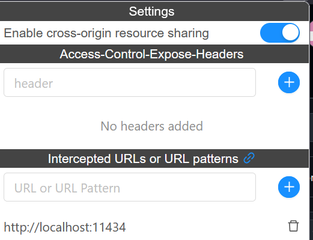

# single_page_llm_chat
 A single page LLM chat inferface. 

For ollama, since it is running on my local host, I had to allow CORS. 

cors-plugin by Raghudevan

I also had to set OLLAMA_ORIGINS="*" on my server before running ollama serve
